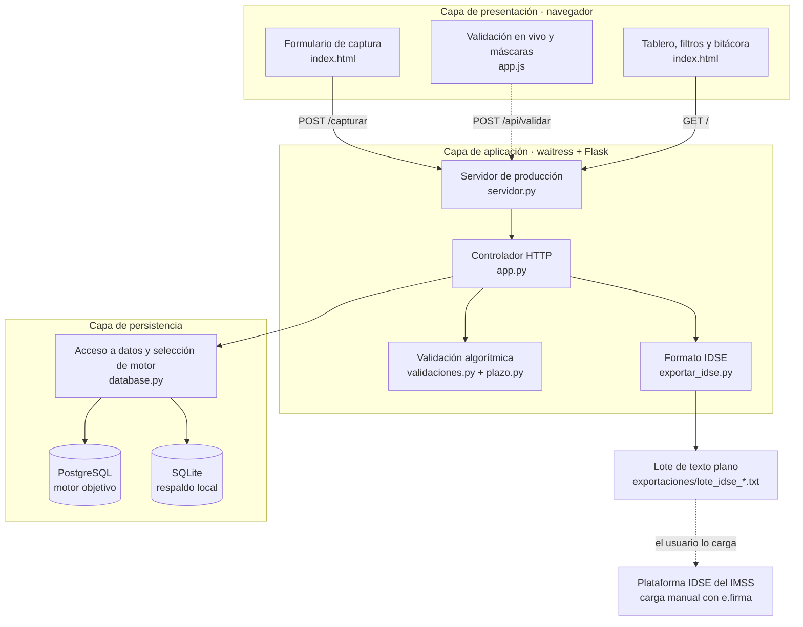
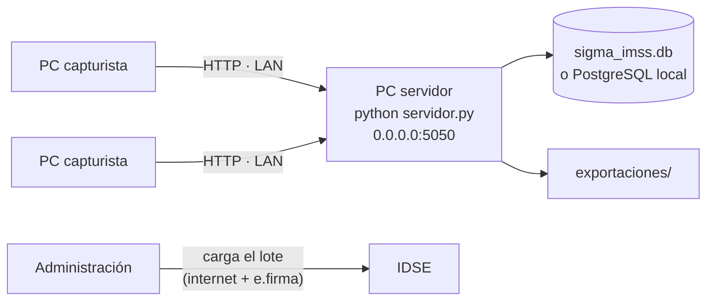

# Arquitectura general

Es una aplicación **cliente-servidor** (Alternativa 3 del E2, [[adr-001-cliente-servidor-con-sgbd-relacional]])
organizada en **4 capas**, cada una sustituible sin tocar las demás.



## Capas
| Capa | Qué hace | Archivos | Página |
|---|---|---|---|
| Presentación | Formulario, tablero, tabla de movimientos, bitácora; validación en vivo, máscaras, tema claro u oscuro. Funciona **sin JavaScript** y **sin internet** | `sigma/templates/`, `sigma/static/` | [[modulo-interfaz]] |
| Aplicación | Arranque en producción, rutas HTTP, flujo, seguridad por petición, reglas de historial | `servidor.py`, `app.py` | [[modulo-servidor]], [[modulo-app]] |
| Reglas | Validación de formato, reglas de la LSS, plazo legal | `validaciones.py`, `plazo.py` | [[modulo-validaciones]], [[modulo-plazo]] |
| Persistencia | Esquema, selección de motor, transacciones, consultas de dominio | `database.py` | [[modulo-database]] |
| Salida | Traducción al lote de texto del IDSE | `exportar_idse.py` | [[modulo-exportar-idse]] |

## Estructura de carpetas
La aplicación es el paquete `sigma/`; en la raíz solo quedan el arranque de producción y lo que no es código
de la aplicación ([[adr-017-paquete-sigma-y-carpeta-de-pruebas]]).

```text
sigma-imss/
├── servidor.py              producción (waitress) → python servidor.py
├── requirements.txt
├── sigma/                   la aplicación
│   ├── __main__.py          desarrollo → python -m sigma
│   ├── app.py  validaciones.py  plazo.py  database.py  exportar_idse.py
│   ├── templates/
│   └── static/
├── pruebas/                 los dos arneses
│   └── resultados/          todo lo que generan (no se versiona)
├── instrucciones/           guías para personas
├── Obsidian/                este segundo cerebro
├── sigma_imss.db            base de trabajo (no se versiona)
└── exportaciones/           lotes IDSE (no se versiona)
```

## Stack
- **Python 3.** El equipo de desarrollo usa 3.14.3, dentro del entorno virtual "LittleLemon" que está en el
  PATH de Pedro.
- **Flask 3.1** con Jinja2: rutas y plantillas.
- **waitress 3.0**: servidor WSGI de producción, sin componentes nativos, funciona en Windows
  ([[adr-009-servidor-de-produccion-waitress]]).
- **PostgreSQL** con psycopg2 como motor objetivo, y **SQLite** como respaldo automático
  ([[doble-motor-de-base-de-datos]]). Para Python ≥ 3.13 no hay psycopg2-binary en `requirements.txt`, así que en
  la laptop de Pedro siempre corre SQLite.
- **HTML5, CSS3 y JavaScript (ES5)** propios: cero CDN y cero frameworks ([[adr-006-frontend-sin-dependencias]]).
- **Git y GitHub:** `github.com/rkiverr/sigma-imss`.

## Principios de diseño (vigentes)
1. **Un solo validador**: el navegador consulta al servidor; las reglas no existen dos veces
   ([[adr-003-un-solo-validador]]).
2. **Errores ≠ avisos** ([[errores-vs-avisos]]).
3. **Integridad transaccional**: toda escritura va dentro de `conexion(commit=True)`, que confirma, revierte y
   cierra aunque haya una excepción ([[modulo-database]]).
4. **La base de datos es la última barrera**: `UNIQUE`, `CHECK` y llaves foráneas, más el índice único del
   movimiento ([[adr-010-unicidad-del-movimiento-en-la-base]]).
5. **Progresivo y sin dependencias**: la interfaz mejora con JS, pero funciona sin él.
6. **Todo en español**: nombres, mensajes y comentarios.

## Despliegue en la oficina

El servidor escucha en la red local. La base de datos **nunca** se expone: con PostgreSQL, el puerto 5432 queda
solo en la interfaz local; con SQLite, la base es un archivo que solo abre el proceso.

Ver también: [[flujo-de-captura]] · [[rutas-http]] · [[modelo-de-datos]] · [[sigma-como-sistema-de-control]] · [[inicio]]
