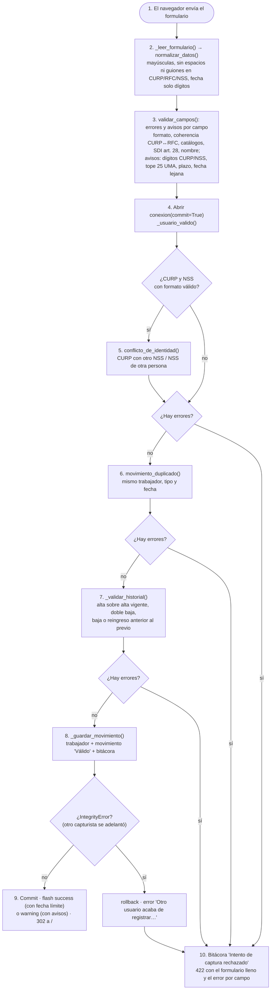

# Flujo de captura de un movimiento (`POST /capturar`)

Qué pasa desde que el capturista oprime **Capturar movimiento** hasta que el sistema guarda o rechaza.
Código: `app.py` → `capturar()`.

## Detalle por paso
1. **Normalización** ([[normalizacion-de-datos]]). Los datos pegados con espacios ya no fallan.
2. **Validación aislada**: `validaciones.validar_campos(datos)` devuelve dos diccionarios, `errores` y `avisos`,
   indexados por campo ([[reglas-de-validacion]]).
3. **Usuario**: `_usuario_valido()` convierte `usuario_id` en un id que exista. Si no, error en `usuario_id`;
   antes del E4 eso era un `ValueError` y un error 500.
4. **Conflicto de identidad**: solo si la CURP y el NSS pasaron el formato. Detecta una CURP ya registrada con
   otro NSS o un NSS de otra persona, **antes** del INSERT (corrección del E4).
5. **Duplicado**: `movimiento_duplicado()` busca el mismo trabajador, tipo y fecha, y responde con su folio.
6. **Historial**: `_validar_historial()` usa `estado_afiliatorio()` ([[historial-afiliatorio]]). Una baja sin
   historial **solo avisa**.
7. **Guardado**: `_guardar_movimiento()` llama a `obtener_patron_id()` y `obtener_o_crear_trabajador()` (que
   actualiza nombre y RFC si el trabajador ya existía), luego al INSERT con estado `'Válido'` y
   `creado_en = now()`, y al final registra en la bitácora "Movimiento capturado".
8. **Carrera**: si dos capturistas pasan las revisiones al mismo tiempo, el índice `UNIQUE` hace fallar al
   segundo. Se atrapa `ERRORES_DE_INTEGRIDAD`, se hace `conn.rollback()` y se devuelve un error claro
   ([[adr-010-unicidad-del-movimiento-en-la-base]]).
9. **Éxito**: un *flash* `success` con "Plazo legal: preséntalo en IDSE a más tardar el DD/MM/AAAA", o un
   *flash* `warning` con los avisos. Luego `redirect` a `/` (patrón PRG).
10. **Rechazo**: se registra en la bitácora el intento con los errores unidos por " | ", y se responde **422**
    renderizando `index.html` con `form=datos`, `errores` y `avisos`, **sin perder lo capturado**
    ([[adr-005-422-conservando-lo-capturado]]).

## Antes de llegar aquí
- El navegador ya validó en vivo con `POST /api/validar`, que usa la **misma** normalización y el **mismo**
  validador, pero **no** las reglas que consultan la base: conflicto, duplicado e historial.
- `preparar_peticion()` (before_request) rechaza con **403** cualquier POST cuyo `Origin` o `Referer` no sea
  el propio host ([[seguridad-web]]).

## Exportación (`POST /exportar`)
1. Valida el usuario.
2. Selecciona los movimientos `'Válido'` con `exportado = FALSE`.
3. `exportar_idse.exportar_lote(registros)` escribe `exportaciones/lote_idse_AAAAMMDD_HHMMSS.txt`.
4. Los marca como `'Exportado'` y registra en la bitácora "Exportación de lote IDSE".

Si no hay pendientes, avisa sin generar nada. Ver [[lote-idse]].

Ver también: [[rutas-http]] · [[modulo-app]] · [[arquitectura-general]]
