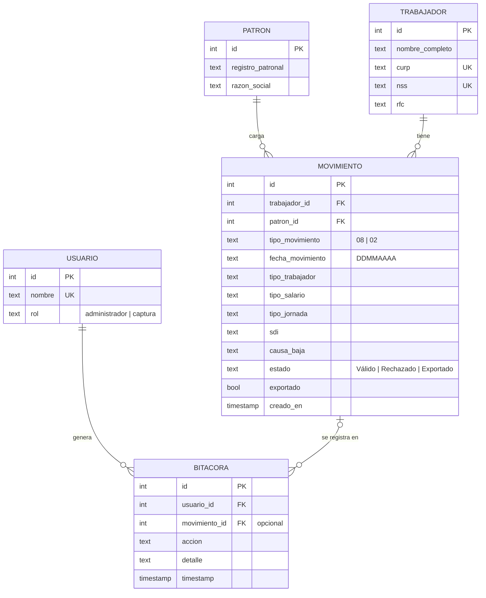

# Modelo de datos

Son **5 tablas normalizadas** (formas normales de Codd, E1/E2). El esquema está en `database.py`, duplicado
solo en el DDL: `_DDL_POSTGRES` y `_DDL_SQLITE` ([[doble-motor-de-base-de-datos]]).

## Por qué está separado así
- Un **trabajador** se registra **una sola vez** (CURP y NSS únicos) y acumula a lo largo del tiempo sus
  altas, bajas y reingresos como filas de **movimiento**. Eso evita duplicar identidad y permite reconstruir el
  historial ([[historial-afiliatorio]]).
- La **bitácora** apunta a un movimiento solo cuando aplica. Los intentos rechazados y las exportaciones no
  tienen movimiento asociado.

## Restricciones e índices
| Restricción | Qué protege |
|---|---|
| `trabajador.curp UNIQUE`, `trabajador.nss UNIQUE` | Una persona = un expediente |
| `usuario.nombre UNIQUE`, `CHECK rol IN ('administrador','captura')` | Usuarios válidos |
| `CHECK tipo_movimiento IN ('08','02')` | Solo altas y bajas |
| `CHECK estado IN ('Válido','Rechazado','Exportado')` | Estados conocidos |
| Llaves foráneas (`PRAGMA foreign_keys = ON` en SQLite) | Integridad referencial |
| `idx_movimiento_estado`, `idx_bitacora_id` | Consultas del tablero y de la bitácora |
| **`uq_movimiento_trabajador_tipo_fecha`** (UNIQUE sobre `trabajador_id, tipo_movimiento, fecha_movimiento`), agregado en el E5 | **El mismo movimiento no puede existir dos veces**, ni con capturas simultáneas ([[adr-010-unicidad-del-movimiento-en-la-base]]) |

El índice único se crea **aparte** del DDL, en un segundo bloque de `init_db()`. Si la base ya trae duplicados,
no se puede crear: solo imprime un aviso y el sistema sigue funcionando.

## Estados de un movimiento
- **Válido**: pasó las validaciones y espera a ser exportado.
- **Exportado**: ya va en un lote; `exportado = TRUE`.
- **Rechazado**: existe en el `CHECK`, pero **hoy ningún flujo lo escribe**. Los rechazos solo quedan en la
  bitácora. Está reservado para cuando se lea el acuse del IMSS ([[hoja-de-ruta-trl6]]).

## Datos semilla (los crea `init_db()`, que es idempotente)
- **Patrón:** `A1234567890` · "Desarrollos Eléctricos y Soluciones Avanzadas S.A de C.V." (`PATRON_SEMILLA`).
  El registro patronal es **inventado**: hay que cambiarlo por el real antes de operar.
- **Usuarios:** `admin.rrhh` (administrador) y `captura.obra1` (captura) (`USUARIOS_SEMILLA`).

## Formatos de almacenamiento
- Fechas de movimiento: texto `DDMMAAAA`, como las pide el IDSE.
- Marcas de tiempo: **texto ISO** `AAAA-MM-DD HH:MM:SS`, generado con `database.ahora()`
  ([[adr-007-marcas-de-tiempo-texto-iso]]).
- SDI: texto con el monto **real** capturado. El tope se aplica solo al exportar ([[salario-sdi-y-limites]]).

## Migraciones
- `init_db()` agrega `movimiento.creado_en` a bases SQLite viejas que no lo tenían.
- En PostgreSQL usa `ALTER TABLE … ADD COLUMN IF NOT EXISTS`.

Ver también: [[modulo-database]] · [[arquitectura-general]]
