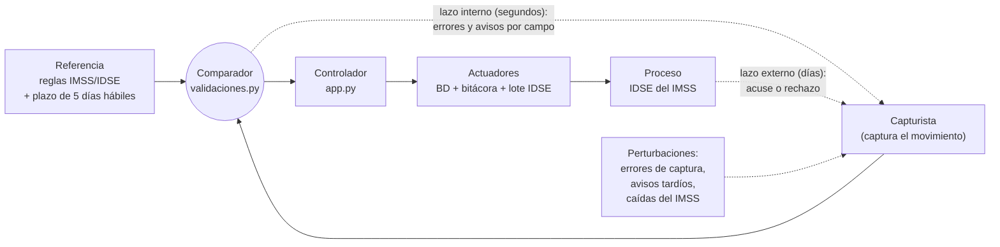

# Sigma como sistema de control (lazo cerrado)

La materia es de **automatización y control**, así que los informes describen Sigma con vocabulario de control
aunque sea software. **Clasificación oficial: lazo cerrado** ([[adr-015-lazo-cerrado]]).

## Dos lazos con escalas de tiempo distintas

| Elemento | En Sigma |
|---|---|
| **Referencia** | Reglas del IMSS: formatos, catálogos, art. 28 y plazo del art. 15 de la LSS |
| **Comparador** | `validaciones.py` → `validar_campos()`, y las reglas de historial de `app.py` |
| **Controlador** | `app.py`: decide guardar o rechazar y orquesta todo |
| **Actuadores (virtuales)** | Escritura transaccional en la base, asiento en la bitácora, generación del lote IDSE y respuesta al operador |
| **Sensores (virtuales)** | El formulario con máscaras, `/api/validar` y las consultas de estado a la base (conflictos, duplicados, historial, contadores) |
| **Sensor del lazo externo** | La lectura del acuse del IMSS. **No implementada** ([[hoja-de-ruta-trl6]]) |
| **Perturbaciones** | Errores de captura (`errores_captura`), avisos tardíos de residentes (`retraso_informacion`), caídas del IMSS |
| **Variables controladas** | `estado_afiliacion` (el estado del trabajador frente al IMSS) y `cumplimiento_plazo` |

## Cómo cambió la clasificación (y por qué importa)
| Entregable | Qué dijo |
|---|---|
| E2 | Lazo cerrado, con el acuse del IMSS como sensor |
| E3 | "Lazo cerrado a nivel software": validador = controlador, exportación = actuador |
| E4 | "Lazo **abierto** con retroalimentación al operador", porque el sistema no corrige los datos solo |
| 2026-09-19 | **Pedro decide: lazo cerrado** |
| E5 | Lazo cerrado con dos lazos: interno (segundos) y externo (días) |

**Por qué es cerrado:** el error se mide (la comparación contra la referencia) y regresa a la entrada como
corrección. El operador forma parte del lazo y corrige lo que el comparador señala. El lazo externo lo cerrará
el acuse del IMSS.

## Uso en la materia de teoría
En la actividad 2.1 de Automatización se modeló el lazo de corrección como G_c(z) = (1 − p)/(1 − p z⁻¹): es
estable y no pierde movimientos. Con p = 0.2, el 99 % de los movimientos se acepta en 3 intentos. Se midió
`validar_campos()` en unos 13 µs por movimiento.

Ver también: [[arquitectura-general]] · [[entregable-2-trl2]] · [[entregable-5-trl5]]
