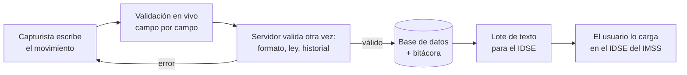

# Sigma — panorama del proyecto

**Sigma** es un sistema web para capturar, validar y exportar las **altas y bajas de trabajadores ante el
IMSS** (los movimientos afiliatorios). Se hizo para **Desarrollos Eléctricos y Soluciones Avanzadas S.A. de
C.V.**, una contratista de instalaciones eléctricas de Escobedo, N.L. que hoy hace este trámite a mano en un
Excel donde el estado de cada trabajador se marca solo con colores ([[empresa-y-problematica]]).

Es el proyecto académico del **Equipo 4** para Laboratorio de Automatización, que se presenta por niveles
TRL ([[equipo-y-contexto-academico]]).

## Estado actual (2026-10-04)

| | |
|---|---|
| Nivel de madurez | **TRL 5**: validado en un ambiente que emula a la empresa ([[entregable-5-trl5]]) |
| Rama vigente | `main` en GitHub (`github.com/rkiverr/sigma-imss`). Incluye el E5 desde el merge `cffd375`, la corrección del calendario (`3afbc9a`) y este segundo cerebro ([[cronologia]]) |
| Cómo se arranca | `python servidor.py` → `http://localhost:5050` ([[como-arrancar]]) |
| Pruebas | `python pruebas/test_prueba_concepto.py` (8/8) y `python pruebas/prueba_ambiente_relevante.py` ([[resultados-de-pruebas]]) |
| En revisión | **PR #2**: la app pasa al paquete `sigma/` y los arneses a `pruebas/`; verificado contra `main` sin diferencias ([[adr-017-paquete-sigma-y-carpeta-de-pruebas]]) |
| Siguiente nivel | TRL 6: piloto en la oficina con datos reales ([[hoja-de-ruta-trl6]]) |

## Qué hace, en una línea por paso

1. El capturista escribe un **alta (08)** o una **baja (02)** en el navegador ([[modulo-interfaz]]).
2. Mientras escribe, la página pregunta al servidor si cada campo es válido ([[normalizacion-de-datos]]).
3. Al guardar, el servidor revisa formato, reglas de la LSS, plazo legal e historial del trabajador
   ([[reglas-de-validacion]], [[flujo-de-captura]]).
4. Si todo está bien, lo guarda junto con un asiento en la bitácora ([[modelo-de-datos]]). Si no, devuelve el
   formulario con el error de cada campo.
5. Al final, arma el **lote** de texto plano que se carga en el **IDSE** ([[lote-idse]]).

## Cómo está hecho

Python 3 con Flask y waitress, PostgreSQL con SQLite como respaldo automático, y HTML/CSS/JS propios sin
dependencias externas. Ver [[arquitectura-general]].

| Archivo | Página |
|---|---|
| `servidor.py` | [[modulo-servidor]] |
| `sigma/app.py` (y `sigma/__main__.py`, el arranque de desarrollo) | [[modulo-app]] |
| `sigma/validaciones.py` | [[modulo-validaciones]] |
| `sigma/plazo.py` | [[modulo-plazo]] |
| `sigma/database.py` | [[modulo-database]] |
| `sigma/exportar_idse.py` | [[modulo-exportar-idse]] |
| `sigma/templates/`, `sigma/static/` | [[modulo-interfaz]] |
| `pruebas/test_prueba_concepto.py` | [[arnes-prueba-de-concepto]] |
| `pruebas/prueba_ambiente_relevante.py` | [[arnes-ambiente-relevante]] |

Por qué está organizado así: [[adr-017-paquete-sigma-y-carpeta-de-pruebas]].

## Lo que no se vuelve a discutir

Las decisiones de diseño y sus porqués están en [[decisiones]]. Las cinco más importantes:
- El sistema se modela como **lazo cerrado** ([[sigma-como-sistema-de-control]]).
- **Un solo validador** compartido por navegador y servidor ([[adr-003-un-solo-validador]]).
- **Errores ≠ avisos**: un error impide guardar; un aviso solo pide confirmar ([[errores-vs-avisos]]).
- **Doble motor** PostgreSQL / SQLite ([[doble-motor-de-base-de-datos]]).
- La **unicidad** de cada movimiento la garantiza la base de datos ([[adr-010-unicidad-del-movimiento-en-la-base]]).

## Números que conviene recordar

- Detección de errores típicos de captura: **96.9 %** (antes del E5: 50 %).
- Capturas simultáneas del mismo movimiento: **0 duplicados y 0 errores 500** (antes: 5 y 7).
- Capacidad: unas **5,900 capturas por minuto** con 10 usuarios sin pausa; la empresa supone hasta 140 al mes.
- Detalle en [[resultados-de-pruebas]].

## Pendientes principales

- **Riesgo #1:** el formato del lote no está confirmado contra el layout oficial del IDSE ([[lote-idse]]).
- Falta login, HTTPS y respaldo automático ([[hoja-de-ruta-trl6]]).
- Cargar cada año los días inhábiles del IMSS y las jornadas electorales ([[mantenimiento-anual]]). No hay bugs
  abiertos ([[bugs-conocidos]]).

## Mapa del wiki

- **Proyecto:** [[empresa-y-problematica]] · [[equipo-y-contexto-academico]] · [[trayectoria-trl]] · [[riesgos]] · [[hoja-de-ruta-trl6]]
- **Entregables:** [[entregables-trl]] y una página por informe (E1–E5).
- **Arquitectura:** [[arquitectura-general]] · [[flujo-de-captura]] · [[rutas-http]] · [[modelo-de-datos]] · [[sigma-como-sistema-de-control]]
- **Reglas del IMSS:** [[reglas-de-validacion]] · [[plazo-legal]] · [[salario-sdi-y-limites]] · [[historial-afiliatorio]] · [[catalogos-idse]] · [[lote-idse]]
- **Conceptos:** [[glosario]] y los conceptos técnicos.
- **Operación:** [[como-arrancar]] · [[configuracion]] · [[mantenimiento-anual]] · [[problemas-frecuentes]] · [[guia-para-modificar-el-codigo]]
- **Calidad:** [[estrategia-de-pruebas]] · [[resultados-de-pruebas]] · [[bugs-corregidos]] · [[bugs-conocidos]]
- **Historia:** [[cronologia]] y las sesiones de trabajo.
- **Preguntas frecuentes:** [[preguntas-frecuentes]]
