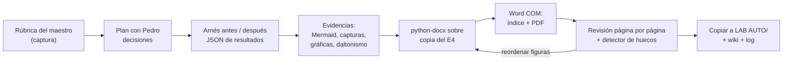
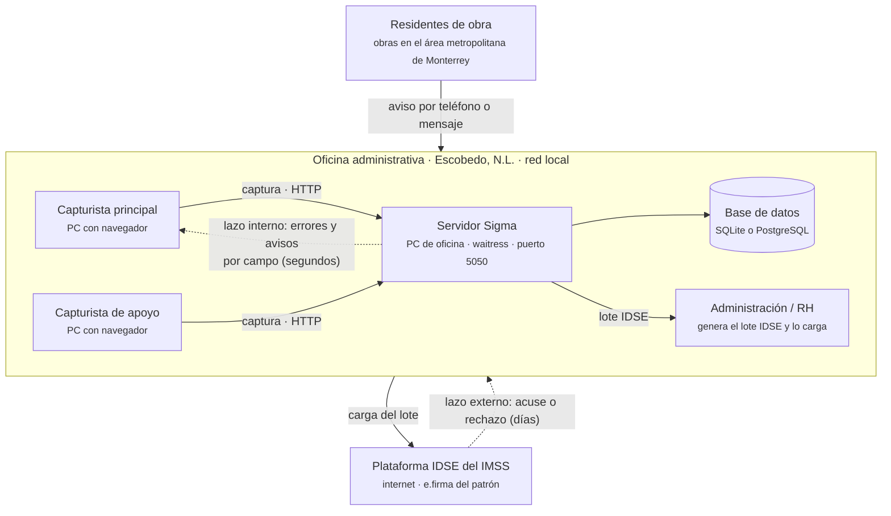
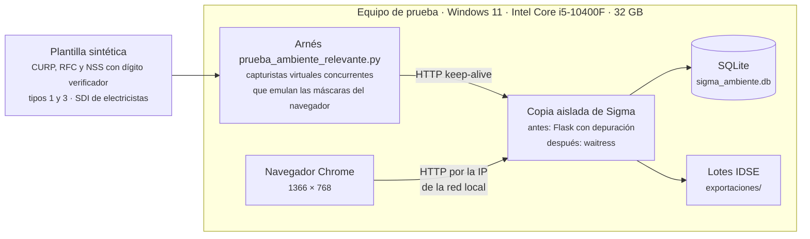

# Cómo se hizo el Entregable 5 (receta para repetirlo en el E6)

Es el método completo con el que se generaron el Word y el PDF del [[entregable-5-trl5]] el 2026-10-04. Los
scripts vivían en el *scratchpad* temporal de la sesión, que se borra; aquí se conserva **lo reutilizable**.

## 1. Pipeline


## 2. Herramientas que hay en la laptop de Pedro
- Python 3.14 con python-docx, pymupdf, Pillow, matplotlib, numpy y pywin32.
- Chrome 154, en `C:\Program Files\Google\Chrome\Application\chrome.exe`.
- Word 2021, para COM.
- No están instalados: pandoc, LibreOffice ni Playwright. Las capturas se hacen con Chrome headless por CLI.

## 3. Base del documento: una copia del informe anterior
```python
doc = docx.Document("base_e4.docx")          # copia del E4 en el scratchpad
hijos = list(doc.element.body.iterchildren())
for el in hijos[15:-1]:                      # 0-14: portada, índice (TOC), salto de sección
    doc.element.body.remove(el)              # se conserva el sectPr final
```
- La portada, el índice con `TOC \o "1-3"`, los estilos (Ttulo1, Ttulo2, Descripcin, Tablaconcuadrcula,
  Prrafodelista) y el pie con número de página se heredan.
- Al final:
  - Se quitan las relaciones huérfanas de imágenes e hipervínculos.
  - Se renumeran los `wp:docPr id` (101, 102, …) para que no choquen.
  - Se ponen los metadatos `author = "Equipo 4"` y `created = now()`, porque la plantilla traía un autor ajeno.

## 4. Funciones de formato (idénticas al E4)
```python
NBSP = "\u00a0"
def _no_separar(t):   # que "96.9 %" o "120 ms" no se partan entre renglones
    t = re.sub(r"(\d) (%|ms|s|MB|GB|cm|UMA|pesos)(?=[\s.,;:)]|$)", r"\1" + NBSP + r"\2", t)
    return re.sub(r"(≤|≥|×) (\d)", r"\1" + NBSP + r"\2", t)

def _runs(p, texto, tam=24, base_negrita=False):      # **negritas** en línea, 12 pt
    for parte in re.split(r"(\*\*.+?\*\*)", _no_separar(texto)):
        if parte:
            neg = parte.startswith("**") and parte.endswith("**")
            r = p.add_run(parte[2:-2] if neg else parte)
            r.font.size = Pt(tam / 2); r.bold = True if (neg or base_negrita) else None

def _formato(p, despues=160, inter=1.5, alin=WD_ALIGN_PARAGRAPH.JUSTIFY):
    p.paragraph_format.space_after = Pt(despues / 20); p.paragraph_format.line_spacing = inter
    if alin is not None: p.paragraph_format.alignment = alin

def h1(t): p = doc.add_paragraph(style="Heading 1"); _formato(p, 0, 1.5, None); r = p.add_run(t); r.bold = True; r.font.size = Pt(16)
def h2(t): p = doc.add_paragraph(style="Heading 2"); _formato(p, 0, 1.5, None); p.add_run(t).bold = True
def parrafo(t): p = doc.add_paragraph(); _formato(p); _runs(p, t)

def vineta(principio, texto):          # "●  Frase inicial en negritas. texto…"
    p = doc.add_paragraph(); _formato(p, 80)
    p.paragraph_format.left_indent = Cm(1.0); p.paragraph_format.first_line_indent = Cm(-0.6)
    p.add_run("●  ").font.size = Pt(12)
    r = p.add_run(principio); r.bold = True; r.font.size = Pt(12)
    _runs(p, " " + texto)

def figura(ruta, ancho_cm, leyenda):   # imagen centrada + "Figura N." ABAJO
    p = doc.add_paragraph(); _formato(p, 40, 1.0, WD_ALIGN_PARAGRAPH.CENTER)
    p.paragraph_format.keep_with_next = True
    p.add_run().add_picture(ruta, width=Cm(ancho_cm))
    c = doc.add_paragraph(style="Caption"); c.paragraph_format.space_after = Pt(12)
    c.alignment = WD_ALIGN_PARAGRAPH.CENTER
    c.add_run(f"Figura {n}. ").bold = True; c.add_run(leyenda)
```
- **Tabla:** la leyenda "Tabla N." va **arriba**, con `keep_with_next`. Estilo "Table Grid", centrada, `tblLayout`
  fijo, anchos en twips sobre 9,360 (el ancho útil). Encabezado sombreado `D9E2F3`, en negritas de 10 pt y con
  `tblHeader` para que se repita en cada página. Celdas de 9.5 pt con espaciado de 2 pt y `cantSplit`. Una fila
  separadora de grupo se une con `merge` y se sombrea `F2F5FA`.
- **Referencias:** estilo "List Paragraph" con `numPr numId=2` (la viñeta de la plantilla) y la URL como
  hipervínculo con el estilo `Hipervnculo`.

**Numeración de figuras:** se usan etiquetas (`F = {"tablero": 6, …}`) y el texto cita `{F['tablero']}`. Así, al
reordenar para la paginación, no se desfasa.

## 5. Diagramas Mermaid → PNG
```python
PLANTILLA = """<!doctype html><html><head><meta charset="utf-8">
<style>body{margin:0;padding:24px;background:#fff;font-family:'Segoe UI',sans-serif}</style>
<script type="module">
import mermaid from 'https://cdn.jsdelivr.net/npm/mermaid@11/dist/mermaid.esm.min.mjs';
mermaid.initialize({startOnLoad:true, theme:'neutral', fontFamily:'Segoe UI, sans-serif',
  flowchart:{htmlLabels:true, curve:'basis', nodeSpacing:40, rankSpacing:60}});
</script></head><body><pre class="mermaid">%s</pre></body></html>"""
# chrome --headless=new --disable-gpu --hide-scrollbars --window-size=1900,1300
#        --force-device-scale-factor=2 --virtual-time-budget=10000 --screenshot=<png> file:///<html>
# luego Pillow: ImageChops.difference contra fondo blanco → getbbox() → recorte con margen de 30 px
```
**Lección:** los diagramas **verticales** dejan huecos enormes en Word y los **muy anchos** no se leen a 16 cm. La
proporción buena va de 1.7:1 a 3.5:1: hacer el diagrama `TB` con un `subgraph` en `direction LR` y enlazar las
flechas **al subgraph**, no a sus nodos. Si una flecha toca un nodo de adentro, Mermaid ignora la dirección. Subir
la fuente (`fontSize`) **empeora** el resultado, porque Mermaid parte las etiquetas.

Fuentes de las dos figuras del E5:



## 6. Capturas reales de la aplicación
1. Se levanta una **copia aislada** con la clase `Servidor` del arnés y se llena con datos de la `Plantilla`.
   Nunca se usa `sigma_imss.db`.
2. Para un GET, se guarda el HTML.
3. Para un POST (422, *flash*), se guarda la respuesta HTML **insertando** `<base href="http://127.0.0.1:PUERTO/">`
   y `data-tema="claro"` en `<html>`. Chrome headless toma el **tema oscuro de Windows**, y el informe va en claro.
4. Se captura con `chrome --headless=new --window-size=1366,<alto> --force-device-scale-factor=1.5
   --virtual-time-budget=1500 --screenshot=… file:///…`. Con un presupuesto corto, las notificaciones (que se ocultan
   a los 7 s) siguen visibles.
5. Para una sección concreta de la página, se inyecta CSS en el HTML guardado
   (`.metricas,.columnas{display:none}`, `tbody tr:nth-child(…)`).

## 7. Simulación de daltonismo (Machado, Oliveira y Fernandes, 2009; severidad 1.0)
```python
DEUTERANOPIA = np.array([[0.367322, 0.860646, -0.227968],
                         [0.280085, 0.672501,  0.047413],
                         [-0.011820, 0.042940, 0.968881]])
PROTANOPIA   = np.array([[0.152286, 1.052583, -0.204868],
                         [0.114503, 0.786281,  0.099216],
                         [-0.003882, -0.048116, 1.051998]])
# sRGB → lineal (c/12.92 si c≤0.04045, si no ((c+0.055)/1.055)^2.4) → @ M.T → sRGB → recortar 0..1
```

## 8. Gráficas
matplotlib con la paleta validada del skill *dataviz*:
- **antes** naranja `#eb6834` y **después** azul `#2a78d6`;
- estados: verde `#0ca30c`, ámbar `#fab219` y rojo `#d03b3b`, siempre con etiqueta de texto.

Van con etiquetas directas al final de cada línea, una sola escala por panel y paneles lado a lado cuando las
medidas son distintas. Se exportan a 7.2 pulgadas y 220 dpi.

## 9. Word por COM: índice y PDF
```python
word = win32.DispatchEx("Word.Application"); word.Visible = False; word.DisplayAlerts = 0
doc = word.Documents.Open(os.path.abspath(ruta_docx))
for _ in range(2):                       # dos pasadas: el índice cambia la paginación
    for toc in doc.TablesOfContents: toc.Update()
    doc.Fields.Update()
doc.Save(); doc.ExportAsFixedFormat(os.path.abspath(ruta_pdf), 17)   # 17 = PDF
paginas = doc.ComputeStatistics(2); doc.Close(False); word.Quit()
```

## 10. Revisión: detector de huecos
Se renderiza cada página del PDF con pymupdf (`get_pixmap(dpi=80)`), en pares lado a lado, y **se revisa
viéndola**. Además, se mide el espacio en blanco al pie:
```python
alto_util = 792 - 72                      # carta en puntos, menos el margen inferior
y = max(fondo de bloques de texto, imágenes y dibujos con y1 < 725)
hueco = (alto_util - y) / (alto_util - 72)  # > 0.18 y la página siguiente empieza con imagen → reordenar
```
**Regla para corregir:** cuando una figura no cabe, se mueve **antes de ella** el texto que la sigue (un
párrafo, otra figura más chica o una sección afín), hasta que ninguna página deje más del ~18 % en blanco.

## 11. Comprobaciones automáticas antes de entregar
- Los H2 coinciden **exactamente y en orden** con la rúbrica.
- Las figuras y tablas van numeradas en secuencia y **todas se citan** en el texto.
- No queda "(por confirmar)", TODO, `{F` ni `None`.
- Las cifras del texto salen del JSON del arnés con `assert` (por ejemplo, `assert B1["tasa_deteccion"] == 96.9`).

Ver también: [[entregables-trl]] · [[sesion-2026-10-04-entregable-5]] · [[arnes-ambiente-relevante]]
