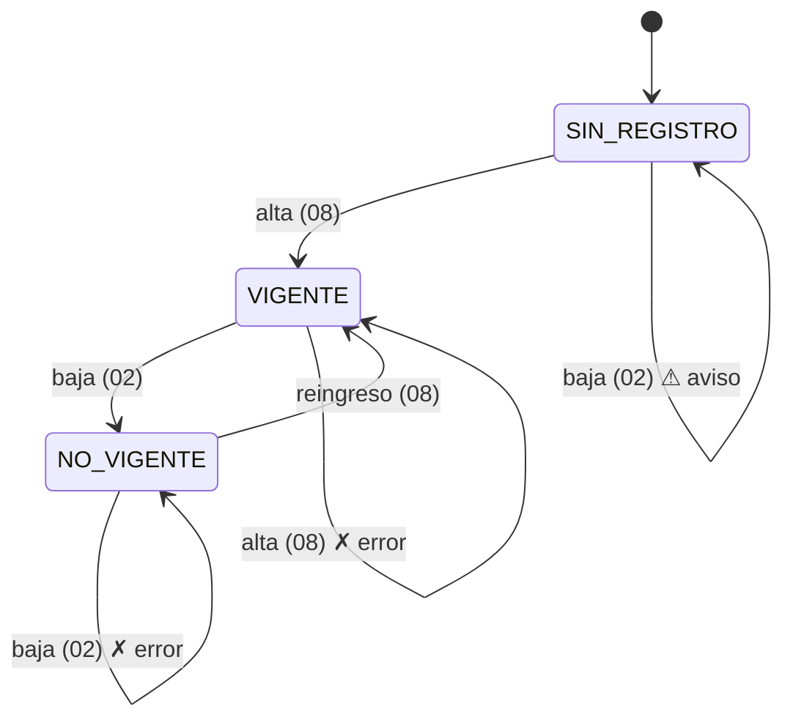

# Reglas de historial afiliatorio

**Regla:** cada movimiento se valida **contra el historial del trabajador**, no aislado.

## El problema que atiende (Entregable 1)
> "El archivo de control tampoco distingue entre un trabajador que salió de una obra pero fue reasignado a otra
> y uno que realmente terminó su relación laboral con la empresa, lo que provoca al mismo tiempo bajas
> indebidas y altas que nunca se dieron de baja."

Una hoja de cálculo no conoce el estado anterior de la fila; una base relacional sí.

## Máquina de estados

`database.estado_afiliatorio(conn, curp)` toma el **último movimiento por fecha real**: reordena DDMMAAAA a
AAAAMMDD en SQL y, si hay empate, toma el id mayor. Excluye los `'Rechazado'`.

## Reglas (`app._validar_historial`)
| Situación | Resultado | Mensaje |
|---|---|---|
| **Alta** con estado VIGENTE | **Error** en `tipo_movimiento` | "El trabajador ya tiene un alta vigente desde el DD/MM/AAAA (folio #N). Si solo cambió de obra no necesita un alta nueva; si salió de la empresa, registra primero la baja." |
| **Reingreso** (alta con estado NO_VIGENTE) con fecha anterior a la baja | **Error** en `fecha_movimiento` | "El reingreso no puede ser anterior a la baja del …" |
| **Baja** con estado NO_VIGENTE | **Error** en `tipo_movimiento` | "El trabajador ya fue dado de baja el … (folio #N); no tiene un alta vigente que cerrar." |
| **Baja** con fecha anterior al alta vigente | **Error** en `fecha_movimiento` | "La fecha de baja (…) es anterior a la del alta vigente (…)." |
| **Baja** con estado SIN_REGISTRO | **Aviso** | "Sigma no tiene registrada un alta de este trabajador. Verifica que esté dado de alta ante el IMSS antes de presentar la baja." |

**¿Por qué la baja sin historial es solo aviso?** Al poner Sigma en marcha habrá personal contratado antes,
cuya alta nunca se capturó en el sistema (riesgo R-09, migración, [[riesgos]]).

## Orden en el flujo
Se evalúa **después** de la detección de duplicados (mismo trabajador, tipo y fecha). Así, un movimiento
repetido recibe el mensaje más específico ("ya fue capturado, folio #N") ([[flujo-de-captura]]). Estas reglas
**no** corren en la validación en vivo, porque necesitan la base.

## Origen
La lógica se tomó de `reglas.py` de la versión alterna del E3 (no entregada) y se implementó en el E5
([[adr-013-reglas-de-historial]]). Antes del E5, los tres casos de error se aceptaban (E-11).

Ver también: [[reglas-de-validacion]] · [[modelo-de-datos]] · [[modulo-app]]
